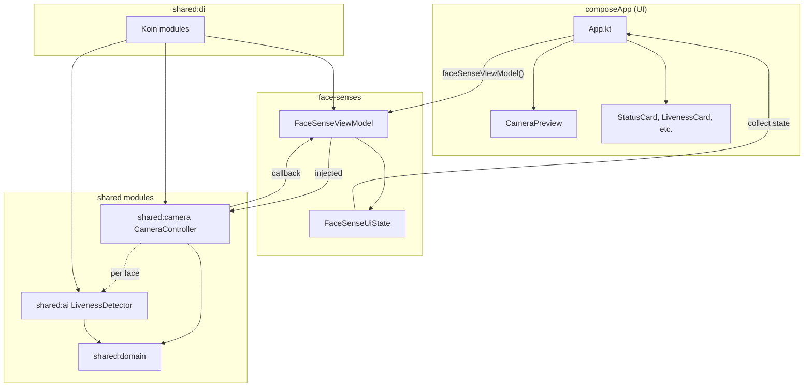
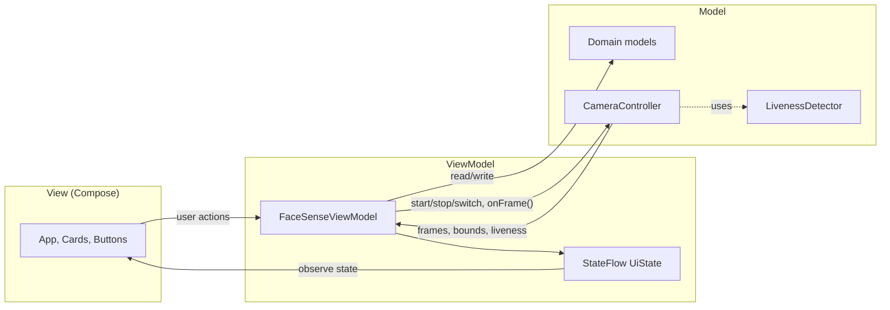
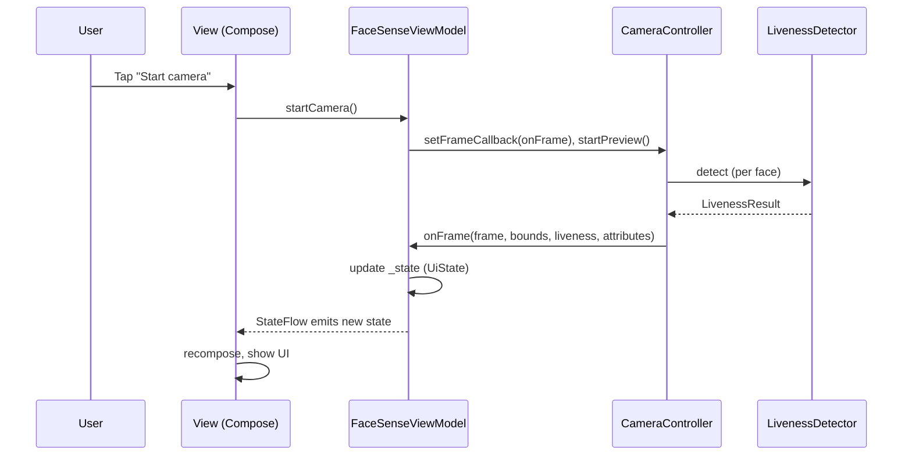

# FaceSense AI

Secure face verification with liveness check for Android and iOS, built with **Kotlin Multiplatform (KMP)**.

---
## Demo Video

Watch a short demo of Face Reorganization:  
[](https://www.youtube.com/shorts/O5RxkXcfKuo)
## Application Architecture Flow

### High-Level Flow Diagram



### High-Level Flow (ASCII)

```
┌─────────────────────────────────────────────────────────────────────────┐
│                           composeApp (UI layer)                          │
│  App.kt → FaceSenseTheme, CameraPreview, StatusCard, ActiveLivenessCard  │
│           LivenessResultCard, ControlButtons, Toast on verification      │
└───────────────────────────────────┬─────────────────────────────────────┘
                                    │ faceSenseViewModel(), state
                                    ▼
┌─────────────────────────────────────────────────────────────────────────┐
│                    face-senses (presentation / feature)                   │
│  FaceSenseViewModel ← CameraController (injected)                        │
│  • startCamera() / stopCamera() / switchCamera()                          │
│  • onFrame(Frame, FaceBounds, LivenessResult, FaceAttributes)             │
│  • Active liveness: blink, head turn, smile, move closer                  │
│  • UiState: FaceSenseUiState (detections, activeLiveness, isFrontCamera)   │
└───────────────────────────────────┬─────────────────────────────────────┘
                                    │ depends on
                    ┌───────────────┴───────────────┐
                    ▼                               ▼
┌──────────────────────────────┐    ┌──────────────────────────────────────┐
│   shared:camera (expect/actual)    │   shared:ai (expect/actual)            │
│   • CameraController interface     │   • createLivenessDetector()           │
│   • Frame, FaceBounds,             │   • LivenessDetector (domain)          │
│     FaceAttributes                 │   • TfliteLivenessDetector (Android)  │
│   • createCameraController()       │   • Stub (iOS)                         │
│   • Android: CameraX + ML Kit      │   • Passive liveness (TFLite model)    │
│   • iOS: stub                     │                                         │
└──────────────────┬───────────────┘    └────────────────┬─────────────────┘
                    │                                       │
                    │  uses domain types                    │  implements
                    ▼                                       ▼
┌─────────────────────────────────────────────────────────────────────────┐
│                        shared:domain (core)                              │
│  • LivenessDetector (interface), LivenessResult                          │
│  • FaceAnalysisResult, BoundingBox                                       │
│  • No framework or platform dependencies                                 │
└─────────────────────────────────────────────────────────────────────────┘
                                    ▲
                                    │
┌───────────────────────────────────┴─────────────────────────────────────┐
│                         shared:di (Koin)                                 │
│  domainModule (empty), platformModule() [Android/iOS], faceSenseModule,   │
│  appModule (FaceSenseHostViewModel)                                      │
│  • CameraController, LivenessDetector, FaceSenseViewModel wired here      │
└─────────────────────────────────────────────────────────────────────────┘
```

### Data Flow (Frame → UI)

1. **Camera** (CameraX on Android) captures frames and runs **ML Kit Face Detection** (bounds + classification: eyes open, smile).
2. For each detected face, **LivenessDetector** (TFLite) runs on a cropped RGB 64×64 image → passive liveness (real vs spoof).
3. **CameraController** invokes the **frame callback** with `(Frame, List<FaceBounds>, List<LivenessResult>, List<FaceAttributes>)`.
4. **FaceSenseViewModel.onFrame()** updates detections and active liveness state (blink, head turn, smile, move closer) from `FaceAttributes` and face position history.
5. **UI** observes `state` and shows preview, boxes, status, verification steps, result card, and **Toast** when all steps are verified.

### Module Roles

| Module         | Role |
|----------------|------|
| **composeApp** | App entry, Compose UI, platform DI, Toast expect/actual, CameraPreview expect/actual. |
| **face-senses** | Feature: FaceSenseViewModel, FaceSenseUiState, ActiveLivenessState, FaceSenseModule (Koin). |
| **shared:domain** | Domain models and interfaces (LivenessDetector, LivenessResult, FaceAnalysisResult, BoundingBox). |
| **shared:camera** | Camera abstraction (CameraController, Frame, FaceBounds, FaceAttributes), expect/actual; Android = CameraX + ML Kit. |
| **shared:ai** | Liveness factory and Android TFLite implementation; depends on domain LivenessDetector. |
| **shared:di** | Koin modules (domainModule, used by app for initialization). |

---

## MVVM Architecture

The app uses **Model–View–ViewModel (MVVM)** in the presentation layer to separate UI from logic and keep the flow testable and platform-agnostic.

### MVVM Flow Diagram



**One-way data flow (detailed):**



### What is MVVM?

- **Model** – Data and business rules. In FaceSense AI this is the domain layer (e.g. `FaceAnalysisResult`, `LivenessResult`, `ActiveLivenessState`) and the data produced by the camera/AI (frames, face bounds, liveness results).
- **View** – UI that displays data and forwards user actions. Implemented with **Compose** in `composeApp` (e.g. `App.kt`, `StatusCard`, `ActiveLivenessCard`, `ControlButtons`). The View does not hold business logic.
- **ViewModel** – Holds UI state and handles user (and system) events. It talks to the Model (camera, domain) and exposes a single source of truth for the View. It does not reference the View or Compose.

Data flows **one way**: ViewModel exposes state → View observes and renders; user/system events → ViewModel updates state (and may call camera/use cases).

### How FaceSense AI Uses MVVM

| Layer | In This Project |
|-------|------------------|
| **Model** | Domain models (`FaceAnalysisResult`, `LivenessResult`, `BoundingBox`, `ActiveLivenessState`), and the stream of data from `CameraController` (frames, face bounds, attributes, liveness). No UI types here. |
| **View** | Compose screens in `composeApp`: `App()`, `CameraPreviewCard`, `StatusCard`, `ActiveLivenessCard`, `LivenessResultCard`, `ControlButtons`. They read `state` and call ViewModel methods (e.g. `startCamera()`, `switchCamera()`, `stopCamera()`). |
| **ViewModel** | `FaceSenseViewModel` in `face-senses`. Holds `FaceSenseUiState` in a `StateFlow`; implements `startCamera()`, `stopCamera()`, `switchCamera()` and the frame callback `onFrame()`. Depends only on `CameraController` (injected via Koin). No Compose or platform UI imports. |

### State Flow

- **ViewModel** owns `_state: MutableStateFlow<FaceSenseUiState>` and exposes `state: StateFlow<FaceSenseUiState>` (read-only).
- **View** subscribes with `viewModel.state.collect { state = it }` (e.g. in `LaunchedEffect`) and recomposes when `state` changes.
- **User actions** (e.g. tap “Start camera”) call ViewModel methods; the ViewModel updates `_state` and/or calls the camera; new data arrives via `onFrame()` and again updates `_state`.

So: **one-way data flow**, **single source of truth** in the ViewModel, and **clear separation** so the View only renders and dispatches events.

### Benefits in This Project

- **Testability** – `FaceSenseViewModel` is unit-tested with a fake `CameraController`; no UI needed.
- **Shared logic** – ViewModel lives in the shared `face-senses` module; the same behavior drives Android and iOS UIs.
- **Lifecycle-safe** – State is in the ViewModel; configuration changes or recomposition don’t lose it.
- **Clear roles** – UI only displays and sends events; all coordination and rules live in the ViewModel.

---

## SOLID Principle Usage

### Single Responsibility (SRP)

- **CameraController**: Only handles camera lifecycle and frame delivery (and optional liveness detector hook). No UI or business rules.
- **LivenessDetector**: Only runs liveness on an image; no camera or UI.
- **FaceSenseViewModel**: Only coordinates camera, frame callback, and active liveness state; no rendering or platform APIs.
- **UI composables**: Each handles one concern (e.g. StatusCard, ActiveLivenessCard, LivenessResultCard).

### Open/Closed (OCP)

- New camera backends (e.g. different SDK) can be added by implementing **CameraController** without changing ViewModel or UI.
- New liveness logic can be added by implementing **LivenessDetector** without changing camera or ViewModel.
- New verification steps can be added via **ActiveLivenessStep** and handling in the ViewModel without changing the camera or AI contracts.

### Liskov Substitution (LSP)

- Any **CameraController** implementation (Android CameraX, iOS stub, test fake) is used the same way by **FaceSenseViewModel**.
- Any **LivenessDetector** implementation (TFLite, stub, mock) can be plugged in where the interface is required.

### Interface Segregation (ISP)

- **CameraController** exposes a small interface (start/stop, callback, optional lifecycle/preview/liveness). No large “god” interface.
- **LivenessDetector** has a narrow contract: `setContext`, `detect(rgbBytes, width, height)`.

### Dependency Inversion (DIP)

- **FaceSenseViewModel** depends on the **CameraController** abstraction, not on CameraX or platform code. Implementations are injected (Koin).
- **shared:domain** defines **LivenessDetector**; **shared:ai** implements it. Domain does not depend on AI or platform.
- **shared:camera** and **shared:ai** depend on **shared:domain** (and optionally each other via interfaces), not the other way around. High-level flow depends on abstractions.

---

## Open Source Libraries

| Library | Purpose | Version (catalog) |
|---------|---------|-------------------|
| **Kotlin Multiplatform** | Shared code for Android & iOS | Kotlin 2.3.0 |
| **Compose Multiplatform** | Shared UI (Compose), Material3, foundation, runtime | 1.10.0 |
| **Koin** | Dependency injection (core, android, compose) | 4.0.0 |
| **Kotlinx Coroutines** | Async and Flow (StateFlow in ViewModel) | 1.9.0 |
| **AndroidX Camera (CameraX)** | Camera API, lifecycle, preview, ImageAnalysis | 1.4.0-alpha04 |
| **AndroidX Camera View** | PreviewView for Compose/Android | (same) |
| **Google ML Kit Face Detection** | Face bounds and classification (eyes open, smile) | 16.1.7 |
| **TensorFlow Lite** | On-device liveness model inference | 2.17.0 |
| **AndroidX Lifecycle** | ViewModel Compose integration (lifecycle-viewmodel-compose, runtime-compose) | 2.9.6 |
| **AndroidX Activity Compose** | Activity + Compose (e.g. MainActivity) | 1.12.2 |

*Ktor and Kotlinx Serialization are in the version catalog but not required for the current face verification flow.*

---

## Features

- Real-time face detection (ML Kit) with bounding boxes.
- Passive liveness (TFLite) to reduce photo/screen spoofing.
- Active liveness: blink, turn head, smile, move closer; all steps verified before “Verified” and Toast.
- Front/back camera switch (Android).
- Dark theme, status card, verification steps, result card, and Toast on full verification.

---

## Project Structure (Key Paths)

- `composeApp/` – App entry, Compose UI, DI, Toast & CameraPreview expect/actual.
- `face-senses/` – FaceSense feature (ViewModel, UiState, DI).
- `shared/domain/` – Domain models and LivenessDetector interface.
- `shared/camera/` – CameraController, Frame, FaceBounds, FaceAttributes, expect/actual.
- `shared/ai/` – createLivenessDetector(), TFLite liveness (Android), stub (iOS).
- `shared/di/` – Koin domain module.

---

## Build and Run

### Android

Open in Android Studio and run `composeApp` on a device or emulator (minSdk 24).

- **macOS/Linux:**
  ```shell
  ./gradlew :composeApp:assembleDebug
  ```
- **Windows:**
  ```shell
  .\gradlew.bat :composeApp:assembleDebug
  ```

### iOS

Build and run the iOS target from your IDE or open the iOS project in Xcode. Shared code is used; camera and liveness on iOS are currently stubbed.

Dependency versions are managed in `gradle/libs.versions.toml`.

---

## Author

**Mirza Adil**

- [LinkedIn](https://www.linkedin.com/in/mirzaadil/)
- [Medium](https://medium.com/@mirzaadil)

---


